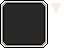

# Build the Game
## 1. Requirements
You will need an archive manager (like WinRAR) and the choicegame soft. (read [Get Started](Get_started.md#get-started) to see how).

From every previous steps you should have a config.cfg that set every folders name and some folders
### The maps folder
You should have every maps you created in it in a .tmx format. Each tileset referenced in each map should be in the tilesets folder next to this folder.
### The tilesets folder
You should have every tilesets you used to create your maps **in png format** other formats will crash the game.

You should have also some characters tilesets (at least the default for the player) that will be in this format :

Respect the orientation of the character, otherwise the player will not look forward when walking. Also the walking animation are on the 1st and 3rd columns.

There is another file you need : the dialog tileset, it while make the dialogs and messages background. It is composed of 4x3 tiles. The first 3x3 block is the frame and the last up right tile is the cursor.

## The fonts folder
If you have a custom font you should put it in this folder. Be aware that only TrueTypeFonts (.ttf) are supported.
## 2. Add the resources
Open choicegame.jar as an archive.

You should delete the maps, tilesets, fonts folders and the config file in it.

Then, you can put in the archive your own maps, tilesets, fonts folders and the config file into it.
## 3. Test the resources
Open a command prompt and go to the folder you have the .jar archive.

Then try to launch it with (replace 'choicegame.jar' with your archive name):
	
	java -jar choicegame.jar

If all is in place, the game should launch normally and you see the start map and the character. Otherwise you can see the error in the logs. They should be indicated with a '#'.
## 4. Troubleshooting

| Error log | Why |
|-|-|
| No config file found | There is no config.cfg file at the root of the archive |
| Error reading folder ... | Try look if there isn't wrong format files (like .jpg files) |
| Font file ... in wrong format | Your custom font is not TrueTypeFont |
| Font file ... not found | The custom font specified in the config.cfg is not in the fonts folder |
| Font ... not found on the Local Graphics Environment | The real name of your custom font is wrong in the config.cfg |
| Error on reading ... | Well... at least you can read why |
| [n] errors with event | Seems like you are not respecting the syntax of events, see [Events](Events.md#events) |
| Invalid map : ... orientation is not orthogonal | Your map seems wrongly created, see [Map Creation](Map_creation.md#map-creation) |
| Invalid map : ... renderorder is not right-down | // |
| Invalid map : ... non existing layer | // |
| Invalid layer : ... no data | // |
| Invalid layer : ... encoding is not CSV | // |
| Invalid layer : ... encoding is not CSV | // |

## 5. Build for other operating systems
When your game is ready and working, you can build the game for other operating systems, download the pre-built archive in the [builds folder](https://github.com/kalioz/Choice-Game/tree/master/builds) and replace files like you did before.

[Back to Table of Contents](Documentation.md#table-of-contents)
