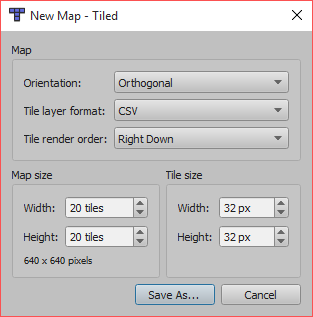
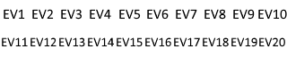
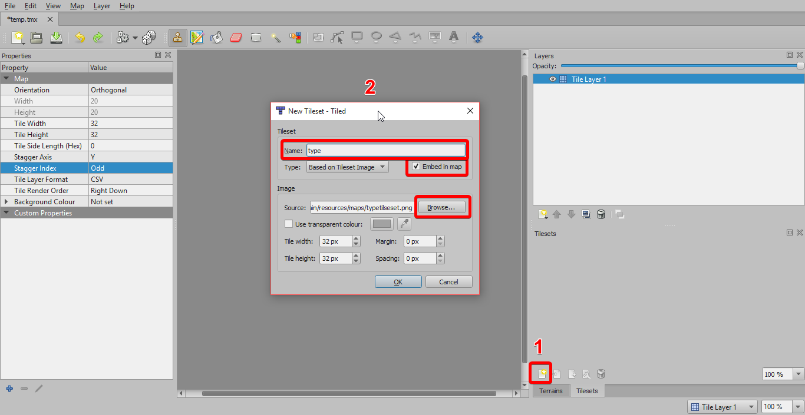
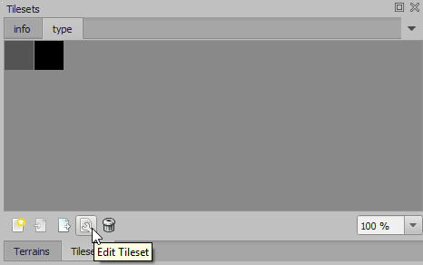
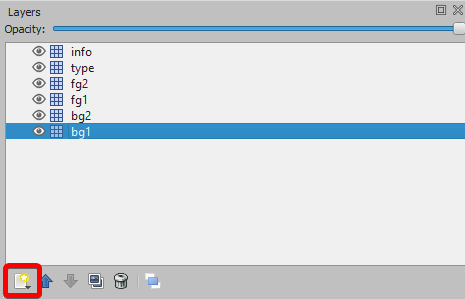
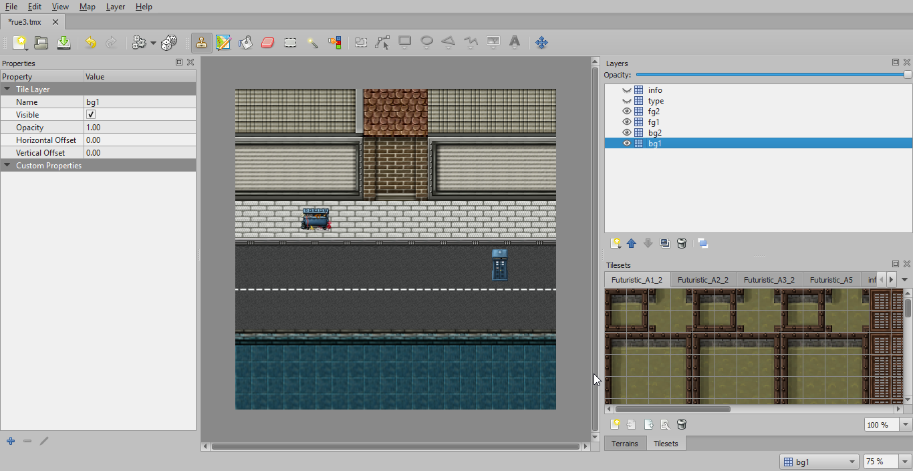
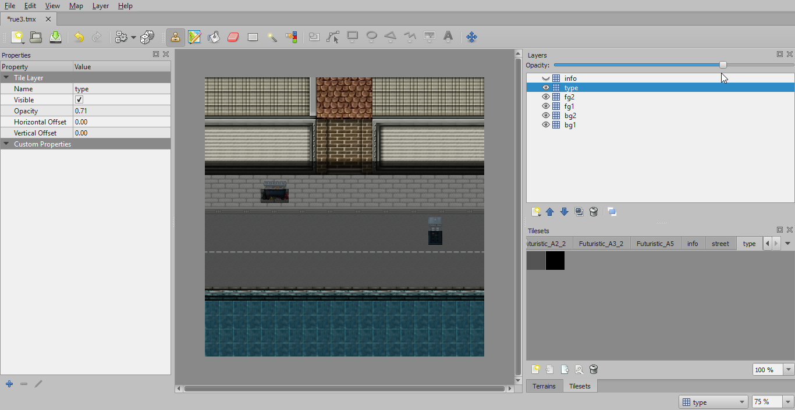
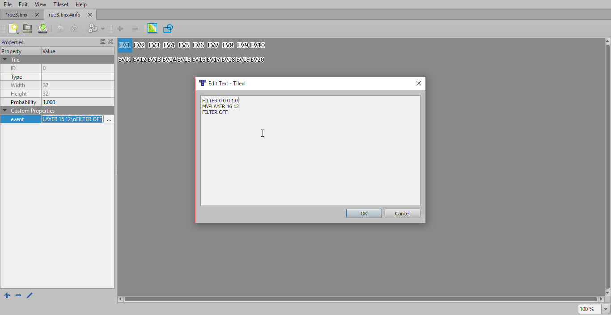
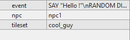

# Map Creation
## 1. Requirements
To create your map you will need [Tiled](http://www.mapeditor.org/) a free map editor wich will generate the good map format for this software.

## 2. Create a new map
In Tiled, create a new map in "File>New>New Map..." In order to have the right map format you need to select these options :

Do not forget to choose the right tile size you will use for your tilesets.
Save your map as .tmx in your wanted location in a "maps" folder (important)
## 3. Import and configure information tilesets
You will need 2 default tilesets in order to create your map the right way, each one should have the same tile size and will be registered in the same "maps" folder. These will not be shown in the game and their purpose is to only store the information into the map.

* A 'type' tileset, wich will contains 1 or 2 basic tiles to fill/delimit the player area :

* An 'info' tileset wich will contains as many events as you want. It may be practical to see wich is wich by labeling them.

Then you will import them into the map this way, remember what there name are for the future. (You can rename them for simplicity)

Now you will edit the type tile

For each tile, add a new 'int' property named 'type' (or another name but remember it for later). Give it the value 1 for the first tile and the value 2 for the other if you have one.

## 4. Import your own tilesets
Now you can import the same way any tilesets you will need to create your map. You will need to place them first in a "tilesets" folder next to the "maps" folder and in a png format. The name of the tileset itself is not important now.

## 5. Create the default layers
You will need to have 6 layers :

* 2 informations layers : the 'info' layer for the events and the 'type' layer for the player area.
* 2 foreground layers : they will be shown over the character.
* 2 background layers : they will be shown below the character.

Your are free to choose the names of these layers. Beware of the order in the software, because they will be shown in this order in it (not in the game).

## 6. Place your tiles
Now that you have everything, you can start to make your map in the foreground and background layers.

## 7. Limit the player area
You will now delimit the player area, in wich he can walk freely. To do so you will need to use the 'type' tileset and the 'type' layer. The tile with the value of '1' will be walkable and the others (void or tile with the value of '2') will not. The opacity of the layer in Tiled can help you create this.

## 8. Create and place events
Configure your 'info' tileset to add events. To do so, add a new string property named 'event' (or another name but remember it for later). Write the script of your event using the events (read [Events](Events.md#events) for the list of available commands).

You can then place your newly created events into the map in the 'info' layer.

## 9. Create and place npcs
Npcs are like events, you create them on the 'info' tileset. To do so you need 3 properties :
* **npc** : The name of your npc
* **tileset** : The tileset of your npc
* **event** : the event of your npc

## 10. You are done
Now you can either create new maps or finish the game by creating the configuration file (read [The Configuration File](Config.md#the-configuration-file)) and building it (read [Build the Game](Build.md#build-the-game)).

## 11. Additional information for maps

* Your player will spawn in the [0,0] tile. You should place an event here that will move him to the right spot (this event will be computed before everything at the start of the map)

[Back to Table of Contents](Documentation.md#table-of-contents)
