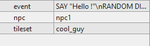

# Créer une carte
## 1. Pré-requis
Pour créer une carte vous aurez besoin de [Tiled](http://www.mapeditor.org/), un éditeur de carte qui va générer le bon format de carte pour ce logiciel.

## 2. Créer une nouvelle carte
Dans Tiled, créer une nouvelle carte dans "File>New>New Map...". Pour avoir le bon format de carte, vous devez sélectionner ces options :

N'oubliez pas de choisir la bonne taille de tile que vous utiliserez pour vos tilesets.
Sauvegardez votre map en .tmx où vous le souhaitez dans un dossier "maps" (important)
## 3. Importer et configurer les tilesets d'information
Vous aurez besoin de 2 tilesets par défaut pour créer votre map, chacun devra avoir la même taille de tile et sera sauvegardé dans le même dossier "maps". Ils ne seront pas affichés dans le jeu, leur but est uniquement de stocker les informations dans la map.

* Un tileset 'type' qui contiendra 1 ou 2  tiles basiques pour remplir/délimiter la zone du joueur : 

* Un tileset 'info' qui contiendra tous les événements que vous voudrez. On peut les distinguer par un label.

Ensuite, vous allez les importer dans la carte de cette façon (rappelez vous leurs noms pour plus tard, en sachant que vous pouvez les renommer).

[select your source and enable 'Embed in map'](img/new_tileset.png)

Maintenant éditez le tile type

ou pour chaque tile, ajouter une nouvelle propriété 'int' nommée 'type' (ou autre chose, mais rappelez vous du nom). Donnez lui la valeur 1 pour la première tile et la valeur 2 pour l'autre (si autre il y a).

[Add a new 'int' property named 'type'](img/add_property.png)

# 4. Importer vos propre tilesets

Désormais vous pouvez importer de la même façon n'importe quel tileset dont vous auriez besoin pour créer votre map. Vous devrez d'abord les placer dans un fichier "tileset" à côté du dossier "maps" et dans un format png. Le nom du tileset n'est pas important maintenant. 

# 5. Créer les couches de base

Vous aurez besoin de 6 couches :

 2 couches informations : la couche 'info' pour les événements et la couche 'type' pour la zone du joueur.

 2 couches premier plan : elles seront affichées au dessus du personnage.
 
 2 couches arrière plan : elles seront affichées en dessous du personnage

Vous êtes libre de choisir les noms de ces couches. Faites attention à l'ordre dans le logiciel, puisqu'ils seront affichés dans cet ordre (pas dans le jeu).

# 6. Placer vos cases

A présent, vous pouvez commencer à créer votre carte dans les couches premier plan et arrière plan.

# 7. Limiter la zone du joueur

Vous devez maintenant délimiter la zone du joueur dans laquelle il pourra se déplacer librement. Pour cela il faut utiliser le tileset 'type' et la couche 'type'. Les tiles avec la valeur '1' seront libres alors que les autres (void or 2) bloqueront les déplacements du joueur. L'opacité de la couche dans le logiciel Tiled peut vous aider à créer cela. 

# 8. Créer et placer des événements
Configurez votre tileset 'info' pour ajouter des événements. Pour cela, ajouter une nouvelle chaine de caractères (string) nommée 'event' (ou un autre nom que vous devrez retenir). Ecrivez le script de votre événement en utilisant les événements (lire [Les événements](Events.md#les-evenements) for the list of available commands).

Vous pouvez ensuite placer votre événement nouvellement créé dans la carte dans la couche 'info'.

## 9. Créer et placer des événements PNJS
Les PNJs sont comme des events, vous les créez sur le layer info. Pour ce faire vous devez utiliser 3 propriétés :
* **npc** : Le nom de votre pnj
* **tileset** : Le tileset de votre pnj
* **event** : L'événement de votre pnj

# 10. Vous avez terminé

 Vous avez terminé, vous pouvez soit créer d'autres cartes ou finir votre jeu en créant le fichier de configuration (lire [The Configuration File](Config.md#the-configuration-file)) et le compiler (lire [Créer une carte](Map_creation.md#creer-une-carte)).

# 11. Informations additionnelles pour les cartes

Votre personnage apparaitra dans la tile [0,0]. Vous devriez placer un événement ici qui le déplacera au bon endroit (cet événement sera pris en compte avant quoi que ce soit d'autre au lancement de la carte). 

[Retour au sommaire](Documentation.md#sommaire)
